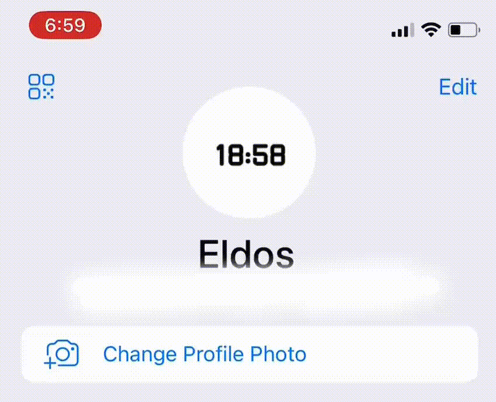

# Telegram Avatar Watch


---

This script updates your avatar photo in Telegram to the current time.

<details>
<summary>How does it look like?</summary>

</details>

Supports light and dark theme.

---

## ❓ How to install

#### 1. Setup virtual environment

```shell
poetry env use python3.11  # create virtualenv
poetry shell  # activate virtualenv
poetry install  # install dependencies
```

#### 2. Create config file in the root of the project

```shell
cp config.example.toml config.toml
```

#### 3. Setup config file

```toml
timezone = 'Asia/Bishkek'
```

You can choose any timezone [here](https://en.wikipedia.org/wiki/List_of_tz_database_time_zones).

---

```toml
[telegram_account]
api_id = 0
api_hash = "djasfjdsjfdsf"
```

Generate pair of API ID and API Hash [here](https://my.telegram.org/auth).

---

```toml
[assets]
font_file_path = "absolute path to .ttf file"
```

Provide absolute path to the `.ttf` file. You can use that one in [assets](./assets) directory.

#### 4. Run script

```shell
python main.py
```

--- 

## Dependencies:

- [pyrogram](https://docs.pyrogram.org)
- [tgcrypto](https://pypi.org/project/TgCrypto/)
- [pillow](https://pillow.readthedocs.io/en/stable/)
